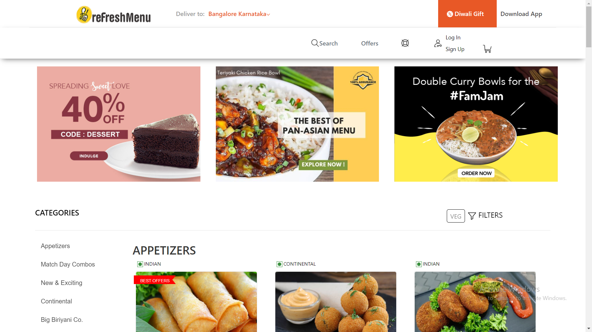

# Refresh-Menu - Food Delivery System

> It is a end-to-end clone of Freshmenu integrated payment gateway, Oauth, Mapbox, OTP.
> Freshmenu is the go-to neighbourhood food delivery option you can turn to when you’re famished.Meals are crafted with the finest ingredients including farm fresh vegetables and meats.Every order is delivered in the shortest possible time frame, right to your doorstep

# Motivation

> Final project of 30 Weeks FSD Course, crafted and painted in team, collaborated virtually @Masai School.

## Code Style

## Tech/framework

[][webdevplaylist]
[][webdevplaylist]
[][cssplaylist]
[][jsplaylist]
[][reactplaylist]
[][webdevplaylist]
[][webdevplaylist]
[][webdevplaylist]
[][webdevplaylist]

[webdevplaylist]: #
[jsplaylist]: #
[cssplaylist]: #
[reactplaylist]: #

 

## Features

- [x] Google Oauth Login
- [x] OTP Login
- [x] Facebook Login
- [x] Map Integrated
- [x] Integrated Payment Gateway

## Screenshots

## Installation

> - Clone the repo
>   `git clone https://github.com/Tripathikritika/Refresh-Menu.git`
> - Inside Front End Folder
>   `cd Frontend`
> - Install NPM packages
>   `npm install`
> - Let the front end start
>   `npm start`
> - Inside Back End Folder
>   `cd Backend`
> - Install NPM packages
>   `npm install`
> - Let the backend run
>   ` nodemon server.js`

## Contributors

Thanks for taking the time to contribute!

1. Kritika Tripathi
2. Omkarnath Parida
3. DhanaSekhar

## Credits

`https://www.freshmenu.com/`
`https://masaischool.com/`
